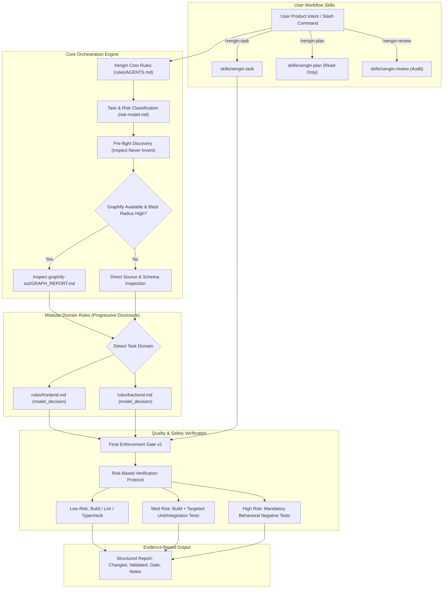

# Xengin System Architecture

Xengin (X Engineering Intelligence) is an autonomous software engineering layer packaged as a **Native Antigravity Plugin**. It establishes an architectural separation of concerns between product intent and technical execution.

---

## 1. High-Level System Architecture

---

## 2. Directory Layout & Roles

- `plugin.json`: The Antigravity plugin manifest, declaring plugin identity, version (`0.3.0-beta.1`), and schema.
- `rules/`:
  - `AGENTS.md`: Consolidated always-on rules (core engineering principles, 10-step lifecycle, Final Enforcement Gate v2).
  - `frontend.md`: Modular frontend rulebook triggered via `model_decision`.
  - `backend.md`: Modular backend rulebook triggered via `model_decision`.
  - `includes/`: Modular reference chapters for frontend, backend, risk model, gate checklist, and knowledge graph policy.
- `skills/`: Exactly three user-facing workflow skills:
  - `xengin-task/`: Primary feature implementation skill (`/xengin-task`).
  - `xengin-plan/`: Read-only architectural and blast-radius planning skill (`/xengin-plan`).
  - `xengin-review/`: 5-dimension code review and diff audit skill (`/xengin-review`).
- `compat/gemini-cli/`: Experimental compatibility layer providing `gemini-extension.json`, `GEMINI.md`, and custom TOML commands for Google Gemini CLI users.
- `examples/`: Reference implementations for frontend features, backend APIs, and architectural plans.
- `docs/`: Technical specifications, migration instructions, benchmarks, and release checklists.
