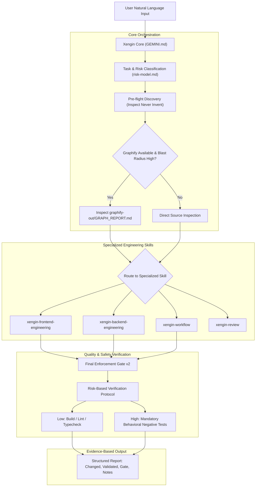

# Xengin Extension Architecture

Xengin (X Engineering Intelligence) is an autonomous software engineering layer packaged as an official Gemini CLI extension. It establishes an architectural separation of concerns between product intent and technical execution.

---

## 1. High-Level System Architecture

---

## 2. Directory Layout & Roles

- `gemini-extension.json`: The extension manifest, declaring name, version, and default context file (`GEMINI.md`).
- `GEMINI.md`: The persistent context engine. Sets invariant boundaries, conflict resolution priority, and the 10-step lifecycle.
- `skills/`:
  - `xengin-frontend-engineering/`: Guides component architecture, state taxonomy (URL vs local), derived state, and accessibility.
  - `xengin-backend-engineering/`: Guides API contracts, Sanctum/JWT auth, tenant scoping, IDOR prevention, DB transactions, deterministic locking, and side effect isolation.
  - `xengin-workflow/`: Holds core policies: universal `final-enforcement-gate.md`, `risk-model.md`, and `graphify-policy.md`.
  - `xengin-review/`: Holds the structured 5-dimension code review rubric.
- `commands/xengin/`:
  - `task.toml` (`/xengin:task`): Primary entry point for engineering feature execution.
  - `plan.toml` (`/xengin:plan`): Read-only architectural and blast-radius planning.
  - `review.toml` (`/xengin:review`): Read-only audit of diffs or target files.
- `docs/`: Operational, architectural, and migration documentation.
