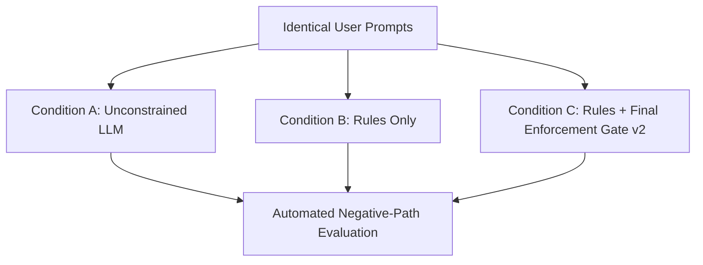

# Xengin Empirical Benchmarking Methodology

To ensure Xengin's engineering rules provide measurable, reproducible value rather than subjective guidelines, all rules and gates were tested using rigorous empirical benchmarks.

---

## Benchmark Design

### 1. Zero History & Workspace Isolation
- Tests were conducted across clean, isolated git worktrees or independent directory clones.
- Subagents operated with isolated conversation histories to eliminate cross-contamination and context leakage.

### 2. Experimental Conditions

- **Condition A (Control)**: Standard LLM pair-programming without Xengin rules or gates.
- **Condition B (Rulebook Baseline)**: LLM equipped with comprehensive domain rulebooks (frontend and backend).
- **Condition C (Full Xengin)**: LLM equipped with domain rulebooks, risk-based classification, and the mandatory **Final Enforcement Gate v2** self-inspection.

### 3. Evaluation Dimensions
Each condition was evaluated against hard behavioral criteria:
1. **Security & Boundary Enforcement**: Were routes mounted with discovered authentication middleware? Did endpoints enforce tenant/user ownership boundaries to prevent IDOR?
2. **Data Integrity & Concurrency**: Were multi-step writes atomic within database transactions? Were external side effects isolated outside DB transactions?
3. **State Reactivity**: Was shareable state placed in URL query parameters? Were derived values computed inline without state-syncing `useEffect` chains?
4. **Architectural Discipline**: Did the agent inspect and reuse existing models, utilities, and components, or did it introduce parallel duplicate architectures?
5. **Code Hygiene**: Presence of `any`, `@ts-ignore`, swallowed exceptions, or stray debug logs.
