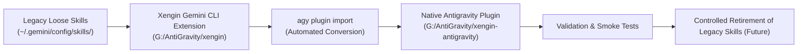

# Xengin Migration & Operating Guide

This guide describes how to migrate from legacy loose rulebook directories and global skills to the native **Xengin** Antigravity plugin and Gemini CLI extension.

---

## 1. Zero-Risk Migration Principle

> [!CAUTION]
> **DO NOT DELETE LEGACY SKILLS YET.**  
> Keep `frontend-agent-rules`, `backend-agent-rules`, and `graphify` in your global skills folder (`C:\Users\amir\.gemini\config\skills\`) until Xengin has been verified across multiple real-world coding sessions.

Xengin skills are uniquely namespaced (`xengin-*`) to avoid naming collisions with legacy skills. Both systems can safely coexist during the transition period.

---

## 2. The Migration Journey



---

## 3. Step-by-Step Native Installation

### Step 1: Import Plugin into Antigravity
Run the official Antigravity CLI import command:

```powershell
agy plugin import G:\AntiGravity\xengin-antigravity
```

Expected output:
```text
  [ok]    xengin
          ✔ skills      : 6 processed
          - agents      : skipped (not found)
          - commands    : skipped (not found)
          - mcpServers  : skipped (not found)
          - hooks       : skipped (not found)

Staged to C:\Users\amir\.gemini\config
```

### Step 2: Validate the Staged Plugin
Verify the staged plugin structure:

```powershell
agy plugin validate C:\Users\amir\.gemini\config\plugins\xengin
```

Expected output:
```text
  [ok]    C:\Users\amir\.gemini\config\plugins\xengin
          ✔ skills      : 6 processed
```

### Step 3: Verify Plugin is Active
```powershell
agy plugin list
```

---

## 4. Controlled Retirement Plan (Only After Real-World Pilot)

Once you have verified that Xengin successfully drives your development across multiple projects:

1. **Create a Full Backup**:
   ```powershell
   Copy-Item -Path "C:\Users\amir\.gemini\config\skills" -Destination "C:\Users\amir\.gemini\config\skills_backup" -Recurse
   ```
2. **Archive Legacy Skills**:
   Remove or move `frontend-agent-rules` and `backend-agent-rules` from `C:\Users\amir\.gemini\config\skills\`.
3. **Keep Graphify**:
   Keep `graphify` in your skills folder; Xengin will detect and use it when relevant.
