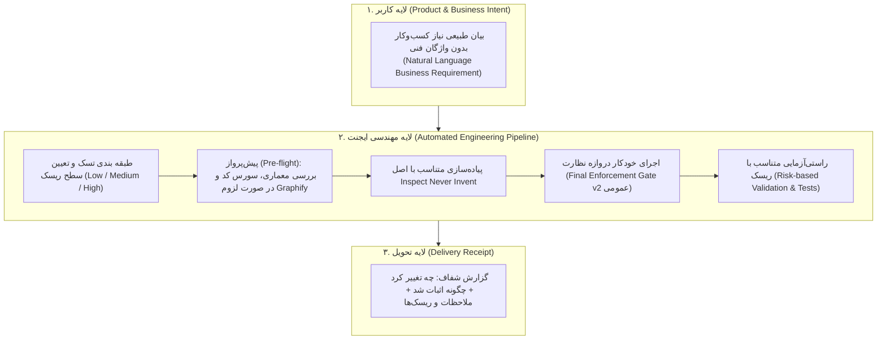
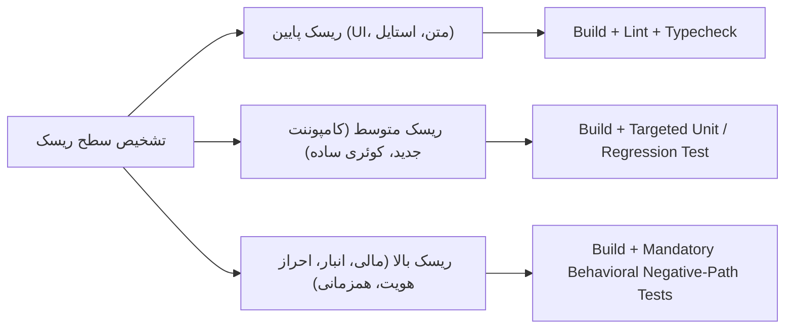

# مرام‌نامه و راهنمای عملیاتی استفاده از هوش مصنوعی در پروژه‌های واقعی
## (The Production-Grade Agentic Workflow Handbook)

> **فلسفه بنیادین:** کاربر مسئول بیان **نیاز محصول و کسب‌وکار (What)** است؛ سیستم و قوانین مسئول **تصمیم‌گیری مهندسی، معماری، امنیت و راستی‌آزمایی (How)** هستند. هیچ بار فنی نباید به پرامپت کاربر تحمیل شود.

---

## ۱. چرخه ۳ سطحی تعامل (The 3-Tier Interaction Model)

---

## ۲. چگونه پرامپت بدهیم؟ (بدون بار فنی و بدون واژگان جادویی)

در این سیستم، پرامپت‌نویسی مهندسی منسوخ شده است. سیستم شما زمانی درست کار می‌کند که پرامپت‌ها دقیقاً مثل صحبت یک Product Manager یا مشتری واقعی با تیم فنی باشد.

### مقایسه پرامپت‌های غلط و درست:

| نوع تسک | ❌ پرامپت پر از جزئیات فنی (میکرومدیریت) | ✅ پرامپت طبیعی و محصول‌محور (روش استاندارد) |
| :--- | :--- | :--- |
| **فرانت‌اند** | فیلتر محصولات را به صورت URL State بساز، useEffect نگذار، فیلترها derived باشن، فرمت کامپوننت را نشکن و Gate را اجرا کن. | در صفحه محصولات، قابلیت فیلتر بر اساس دسته‌بندی و موجودی را اضافه کن. می‌خواهم با رفرش صفحه یا ارسال لینک به دیگران، فیلترهای انتخابی باقی بمانند. |
| **بک‌اند (API)** | روت POST برای لغو بساز، میدلور auth بذار، IDOR و Mass Assignment رو چک کن، دیتابیس با ترنزکشن باشه، پیامک بیرون ترنزکشن و تست بنویس. | کاربر بتواند از پنل کاربری، سفارش در انتظار پرداخت خود را لغو کند. اگر سفارش ارسال شده بود نباید لغو شود و پس از لغو موفق، به ادمین اطلاع داده شود. |
| **دیتابیس / انبار** | با قفل سطری و ksort بنویس که Deadlock نده و رول‌بک بشه. | هنگام ثبت سند تولید، قطعات از انبار کسر و محصول نهایی اضافه شود. اگر موجودی قطعه‌ای کم بود، کل عملیات متوقف شود تا موجودی ناقص نخورد. |

> [!IMPORTANT]
> **«عبارت جادویی» یک Fallback است، نه استاندارد روزمره:**  
> اگر سیستم و Global Skills درست فعال باشند، شما **نباید** در هر پرامپت بنویسید «قوانین را رعایت کن و Gate را صدا بزن».  
> این یادآوری تنها زمانی مجاز است که احساس کنید در یک پلتفرم متفرقه یا شرایط ناپایدار، ایجنت استانداردهای کیفی را رعایت نکرده است.

---

## ۳. عمومی‌سازی دروازه نظارت (Generic & Risk-Based Gate v2)

دروازه نظارت نباید متکی به راه‌حل‌های ویژه یک پروژه خاص (مانند `ksort` در لاراول/InnoDB) باشد، بلکه بر اساس **اصول مهندسی عمومی** عمل می‌کند:

### چک‌لیست عمومی Gate v2 در تمام فریم‌ورک‌ها و پروژه‌ها:

1. **مرزهای احراز هویت و دسترسی (Auth & IDOR):**
   - هویت کاربر باید منحصراً از توکن/سشن معتبر استخراج شود؛ هیچ آیدی مالکیت کلاینتی به صورت خام مبنای دستکاری داده قرار نگیرد.
   - سناریوی رد درخواست کاربر تاییدنشده (۴۰۱ یا ۴۰۳) بررسی شود.
2. **کنترل همزمانی و یکپارچگی داده (Concurrency & Atomicity):**
   - هر جا چند سطر یا چند جدول به صورت وابسته ویرایش می‌شوند، از تراکنش (Transaction) استفاده شود.
   - در صورت حساسیت به همزمانی، استراتژی قفل‌گذاری متناسب با دیتابیس (Optimistic یا قفل صعودی سطری در دیتابیس‌های رابطه‌ای) اتخاذ شود تا ریسک بن‌بست کمینه گردد.
   - اثرات جانبی شبکه (ارسال ایمیل/پیامک/Webhook) حتماً **خارج از تراکنش دیتابیس** اجرا شوند.
3. **سلامت و پایداری وضعیت (State Persistence):**
   - تنها استیت‌هایی به URL منتقل می‌شوند که کاربر انتظار دارد با رفرش یا اشتراک‌گذاری لینک حفظ شوند (`search`، `tab`، `page`). وضعیت‌های گذرا (مثل باز بودن یک منوی آبشاری) در استیت محلی باقی بمانند.
4. **بهداشت کد و لاگینگ (Code Hygiene & Logging):**
   - لاگ‌های موقت دیباگ (`console.log`های اضافی) پاک شوند؛ لاگ‌های ضروری از سیستم ساخت‌یافته پروژه (مثل لاگر استاندارد لاگین/ارور) تبعیت کنند.
   - استفاده از `any` در تایپ‌اسکریپت ممنوع است، مگر در مواردی که با کامنت فنی توجیه شده باشد.
5. **راستی‌آزمایی متناسب با ریسک (Risk-Based Verification):**
   - **ریسک پایین:** تست ساخت (`build`)، تایپ و لینت.
   - **ریسک بالا:** **ایجنت موظف است بدون نیاز به درخواست کاربر** تست رفتاری برای مسیرهای شکست (Negative Paths) بنویسد (مانند کسری موجودی، درخواست غیرمجاز، ورودی معیوب).

---

## ۴. جایگاه واقعی Graphify در پروژه‌ها

بر اساس شواهد بنچمارک کور:
1. **وجود صرف فایل‌های گراف در پروژه کافی نیست؛** ایجنت به صورت خودبه‌خودی به سراغ آن نمی‌رود مگر آنکه در قانون‌نامه به آن ارجاع داده شده باشد.
2. **کاربرد مشروط:** در کارهای ساده و تغییرات نقطه‌ای، ایجنت نباید وقت خود را صرف خواندن گراف کند.
3. **در کارهای با Blast Radius متوسط و بالا:** ایجنت ابتدا نقشه معماری را از `GRAPH_REPORT.md` می‌خواند تا محدوده وابستگی‌ها و نام مدل‌ها/سرویس‌های درگیر را شناسایی کند.
4. **مرجع نهایی همواره کدهای پروژه (Source Code) است:** گراف به درک سریع کمک می‌کند، اما امضای متدها، فیلدهای مایگریشن و رفتارهای زنده همیشه با سورس کد اعتبارسنجی می‌شوند.

---

## ۵. مدیریت قوانین و جلوگیری از دوگانگی نسخه‌ها (Single Source of Truth)

برای اینکه قوانین محلی پروژه و قوانین عمومی سرور با یکدیگر ناسازگار نشوند (Drift):

### الف) حالت تک‌کاربره (Solo Developer):
- **تنها منبع حقیقت (Canonical Source):** مهارت‌های عمومی سیستم در پوشه `~/.gemini/config/skills/` هستند.
- در داخل هر مخزن نیازی به کپی کردن فایل‌های بزرگ قوانین نیست؛ حداکثر یک فایل راهنمای کوچک مثل `AGENT-RULES.md` قرار دهید که صرفاً استثناها یا قراردادهای خاص تجاری همان پروژه را ذکر کند.

### ب) حالت تیم‌های نرم‌افزاری (Team Repositories):
- یک پوشه `rules/` در ریشه مخزن گیت قرار می‌گیرد که همراه پروژه نسخه‌بندی می‌شود (`version: 1.2.0`).
- مهارت عمومی ایجنت صرفاً نقش Loader/Dispatcher را ایفا کرده و قوانین درون گیت را بر قوانین عمومی ترجیح می‌دهد.

---

## ۶. رویکرد مهندسی به دستورات تکمیلی (`/plan`, `/boost`, `/learn`)

- **`/plan`:** منحصراً برای کارهای با شعاع تخریب بالا (High Blast Radius)، مایگریشن‌های حساس دیتابیس یا ریفکتورهای چندلایه استفاده شود. برای کارهای روتین و افزودن یک دکمه یا فیلد ساده، استفاده از پلن اتلاف زمان است.
- **`/learn`:** برای قراردادهای تجاری و ساختاری حیاتی، حافظه درونی ایجنت ممکن است دستخوش ابهام شود. **قراردادهای کلیدی دامنه کسب‌وکار بهتر است در یک فایل متنی در خود پروژه (مثل `docs/conventions.md`) ثبت شوند تا در گیت هم ردیابی شوند.**

---

## ۷. نتیجه‌گیری واقع‌بینانه: تعریف موفقیت

هدف این سیستم این نیست که ادعا کند «هوش مصنوعی دیگر هرگز اشتباه نمی‌کند».  
هدف واقعی این است:

> **ایجنت به یک فرآیند منضبط مهندسی مجهز شده است که اجازه نمی‌دهد خطاهای رایج، نشت‌های امنیتی، معماری‌های موازی و فرضیات اثبات‌نشده از دید نظارت پنهان بمانند و قبل از رسیدن کد به مرحله نهایی، آن‌ها را شناسایی و مهار می‌کند.**
