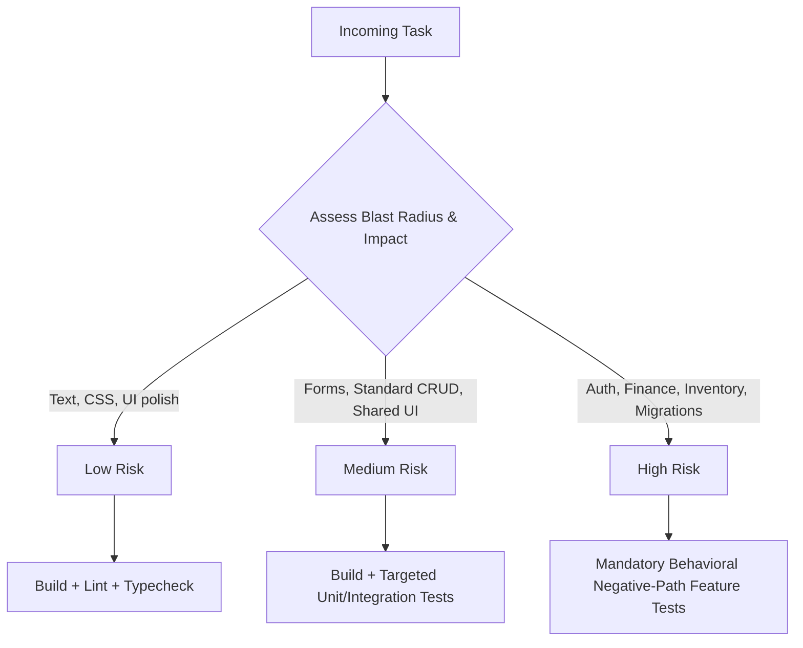

# Xengin Risk-Based Engineering Model

Software engineering decisions and verification rigor must scale proportionally with risk. The user should not have to micromanage testing levels; Xengin determines the required verification depth automatically.

---

## Risk Level Taxonomy

---

### 1. Low Risk

#### Scope & Examples:
- Copy/text changes and typographical adjustments.
- Pure CSS/styling updates that do not alter layout flow or responsive behavior.
- Isolated presentational UI modifications with no business logic or state mutations.
- Adding non-sensitive documentation or comments.

#### Required Verification:
- Syntax and compilation check (e.g. `npm run build`, `tsc --noEmit`, or linter).
- Visual or markup inspection.
- Automated behavioral tests are **NOT** required.

---

### 2. Medium Risk

#### Scope & Examples:
- Form submissions and client-side form validations.
- Standard CRUD API endpoints that do not involve financial calculations, inventory, or security boundaries.
- Shared component modifications with multiple existing consumers.
- URL-driven filtering and client-side sorting.

#### Required Verification:
- Full build and typecheck.
- Targeted unit or integration tests covering normal execution and validation error states.
- Verification that existing consumers of modified shared components remain unbroken.

---

### 3. High Risk

#### Scope & Examples:
- Authentication, authorization, token issuance, or permission scoping.
- Financial transactions, billing, payments, or ledger operations.
- Inventory deductions, bill of materials (BOM), or warehouse cardex updates.
- Concurrency-sensitive operations subject to race conditions or deadlocks.
- Database migrations modifying existing production tables or schemas.
- Irreversible or destructive data operations (cascading deletes, mass archival).
- Cross-tenant data isolation.

#### Required Verification (MANDATORY & AUTOMATIC):
- **User request not required**: Xengin MUST automatically implement and execute automated behavioral tests for these tasks.
- **Domain-Tailored Negative-Path Invariants**:
  Rather than applying a rigid, one-size-fits-all checklist to every task, negative-path tests MUST be tailored to the specific risk domain:

  1. **Authentication & Authorization Domain**:
     - *Unauthenticated Boundary*: Unauthenticated requests return 401. (Skip if the endpoint is explicitly public, such as user registration, login, or public catalog).
     - *Unauthorized / Ownership Boundary*: Cross-tenant or cross-user requests return 403 / 404 (IDOR immunity).
  2. **Transactional & State Mutation Domain**:
     - *Atomic Rollback Invariant*: In multi-step writes, if any validation or constraint fails, verify that zero partial writes and zero orphan records persist in the database.
     - *Idempotency*: Re-submitting an identical idempotent request does not produce duplicate state or duplicate charges.
  3. **Concurrency & Resource Allocation Domain (Inventory, Balances)**:
     - *Insufficient Balance / Stock*: Reject operations when available quantity/balance is insufficient, without corrupting ledgers.
     - *Race Condition Protection*: Verify that simultaneous requests cannot cause overselling or double-spending.
  4. **Destructive Operations & Migrations Domain**:
     - *Cascade Safety*: Verify foreign key constraints and prevent unintended deletion of related parent/child records.
     - *Zero-Downtime Migration*: Verify backward-compatibility across expand-migrate-contract phases.
  5. **Side Effect Isolation**:
     - External network failures (e.g. SMS/email gateway unreachable) must not abort committed database transactions, and critical delivery must be recoverable.
