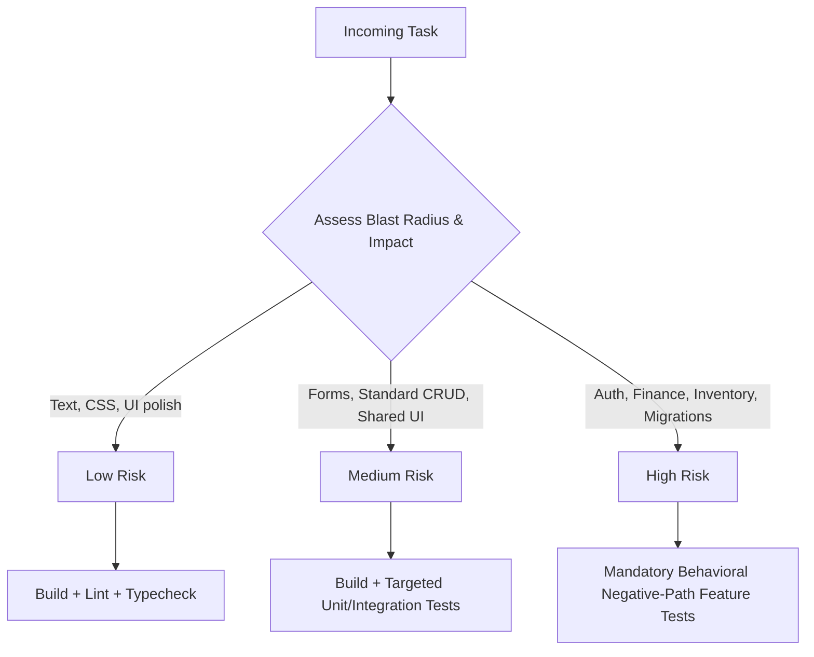

# Xengin Risk-Based Engineering Model

Software engineering decisions and verification rigor must scale proportionally with risk. The user should not have to micromanage testing levels; Xengin determines the required verification depth automatically.

---

## Risk Level Taxonomy

---

### 1. Low Risk

#### Examples:
- Copy/text changes and typographical adjustments.
- Pure CSS/styling updates that do not alter layout flow.
- Isolated presentational UI modifications with no business logic or state mutations.
- Adding non-sensitive documentation or comments.

#### Required Verification:
- Syntax and compilation check (e.g. `npm run build`, `tsc --noEmit`, or linter).
- Visual or markup inspection.
- Automated behavioral tests are **NOT** required.

---

### 2. Medium Risk

#### Examples:
- Form submissions and client-side form validations.
- Standard CRUD API endpoints that do not involve financial calculations or inventory.
- Shared component modifications with multiple existing consumers.
- URL-driven filtering and client-side sorting.

#### Required Verification:
- Full build and typecheck.
- Targeted unit or integration tests covering normal and validation error states.
- Verification that existing consumers of modified shared components remain unbroken.

---

### 3. High Risk

#### Examples:
- Authentication, authorization, token issuance, or permission scoping.
- Financial transactions, billing, payments, or ledger operations.
- Inventory deductions, bill of materials (BOM), or warehouse cardex updates.
- Concurrency-sensitive operations subject to race conditions or deadlocks.
- Database migrations modifying existing production tables or schemas.
- Irreversible or destructive data operations (cascading deletes, mass archival).
- Cross-tenant data isolation.

#### Required Verification (MANDATORY & AUTOMATIC):
- **User request not required**: Xengin MUST automatically implement and execute automated behavioral tests for these tasks.
- **Negative-Path Invariants**:
  1. *Unauthenticated Boundary*: Unauthenticated requests return 401.
  2. *Unauthorized / Ownership Boundary*: Cross-tenant or cross-user requests return 403 / 404 (IDOR immunity).
  3. *Atomic Rollback Invariant*: In multi-step writes, if any constraint fails (e.g. insufficient inventory, payment gateway rejection), verify that zero partial writes and zero orphan records persist in the database.
  4. *Side Effect Isolation*: External network failure (e.g. SMS gateway down) must not cause the completed database transaction to abort.
